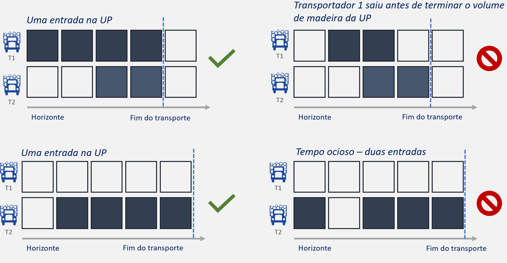
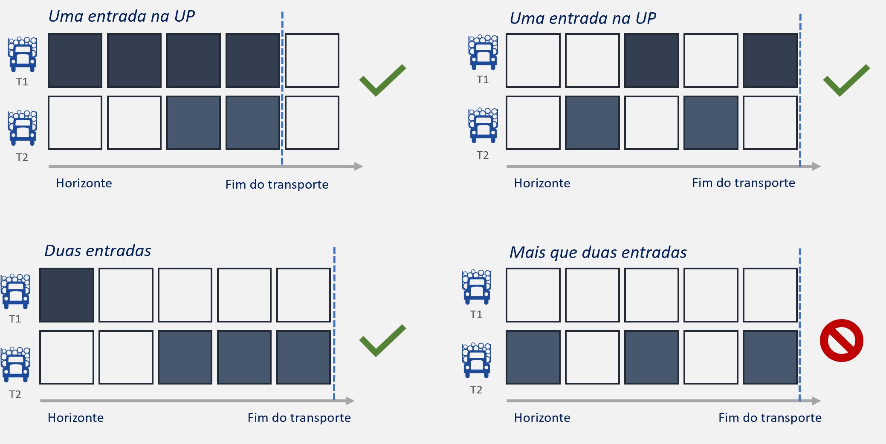

# Desafio de otimização

## Objetivo
Testar as habilidades em programação linear inteira mista da(o) candidata(o) que deseja ingressar no time de Ciência de Dados da Suzano SA.

### Objetivos específicos
1 - Desenvolver um programa com as seguintes especificações:
* Ler arquivo no formato .xlsx fornecido
* Implementar um modelo matemático que atenda corretamente as regras de negócio fornecidas
* Gerar um arquivo de saída no formato .xlsx ou .csv com a solução encontrada
* Usar preferencialmente a linguagem Python
* Usar qualquer biblioteca que ajude a criar as regras de negócios

2 - Gerar relatório com as informações abaixo:
* Instruções para executar o programa
* Modelo matemático utilizado no desenvolvimento do programa
* Premissas assumidas e análises sobre as regras de negócios
* Críticas e sugestões sobre o desafio
* Qualquer outra informação que a(o) candidata(o) ache relevante

## Definição do problema
A [Suzano](https://www.suzano.com.br/) é uma multinacional brasileira, referência global no desenvolvimento de soluções sustentáveis e inovadoras, de origem renovável. Maior fabricante de celulose do mundo e uma das maiores produtoras de papel da América Latina, seus produtos atendem mais de 2 bilhões de pessoas em mais de 100 países. A empresa centenária possui uma capacidade instalada de 12,5 milhões de toneladas de celulose de mercado, atuando verticalmente desde operações florestais até logística de atendimento de nossos clientes.

As florestas de eucalipto da Suzano encontram-se em uma diversidade de fazendas espalhadas pelo país. Cada fazenda é dividida em Unidades Produtivas (UPs). Após a colheita de cada UP, um volume de madeira é gerado e precisa ser transportado para as fábricas.
Esse transporte deve ser planejado com granularidade diária com a frota de veículos disponível, obedecendo um conjunto de premissas e com o melhor sequenciamento possível.

O melhor sequenciamento, dentre todos os possíveis, é aquele que possui a menor variação da densidade básica (DB) diária das madeiras que chegam na fábrica. A variação da DB no dia $t$ é dada por $\Delta DB^t = DB^t_{max} - DB^t_{min}$.

### Premissas de negócio

| Entidade        | Premissa               | Descrição  |
|---|---|---|
| Fábrica         | Demanda diária         | O volume de madeira entregue diariamente deve respeitar os intervalos definidos no arquivo de entrada. |
| Fábrica         | Qualidade da madeira  | A média ponderada pelos volumes transportados diariamente da Relação Sólido/Polpa (RSP) de cada UP deve estar dentro dos limites estipulados. |
| Fluxo           | Capacidade de veículos | A capacidade de transporte diário é definida pela caixa de carga e tempo de ciclo entre UP de origem e fábrica de destino. |
| Fluxo           | Capacidade de gruas    | Um transportador pode estar simultaneamente em um número máximo de UPs igual ao número de gruas disponíveis. |
| Transportador   | Atribuição Transportador x Fazenda | Não pode haver atuação simultânea do transportador em duas fazendas distintas. |
| Transportador   | Consumo de recursos    | O limite de equipamentos mínimo e máximo de cada transportador precisa ser respeitado. |
| Transportador   | Gruas    | Dado que uma transportadora está atendendo diferentes UPs (ver restrições de Fluxo - Capacidade de gruas), o número de veículos em cada frente de atendimento (UP) deve respeitar um percentual mínimo com relação ao total de veículos em atividade da transportadora para cada dia. |
| Fazendas        | Transporte completo | Ao começar o transporte de uma fazenda, o transportador só pode trocar de fazenda ou interromper a atividade se completar o transporte do volume total disponível na fazenda. Ver a primeira ilustração abaixo.|
| UPs             | Transporte completo     | Ao começar o transporte de uma  UP menor que 7000 m³, o transportador só pode trocar de UP ou interromper a atividade se completar o transporte do volume total disponível na UP. Ver a primeira ilustração abaixo.|
| UPs             | Transporte fracionado    | A UP maior que 7000 m³ pode ter atividades de transporte descontínuas no horizonte com até duas entradas. Ou seja, pode existir até um intervalo sem atividade de qualquer transportador na UP entre dois intervalos com transporte. Ver a segunda ilustração abaixo. |

## Ilustrações das premissas de negócio
As ilustrações abaixo representam os comportamentos esperados para as premissas.

##### Fazendas e UPs menores que 7000 m³

##### UPs maiores que 7000 m³

## Descrição do arquivo de entrada
O arquivo de entrada é composto pelas abas HORIZONTE, BD_UP, FROTA, FABRICA, ROTA, GRUA.

| Aba | Descrição | Colunas
| --- | --- | --- |
| HORIZONTE | Contempla o horizonte de dias de planejamento. |  DIA, MES, ANO, CICLO_LENTO |
| BD_UP | Contém dados dos volumes e da qualidade da madeira colhida em cada UP. | UP, FAZENDA, DB, VOLUME, RSP, DATA_COLHEITA, IDADE_FLORESTA, IMA, RD, RESERVADO, CLONE, ESPECIE, PRECIPITACAO |
| FROTA | Descreve os transportadores disponíveis com seus respectivos números mínimo e máximo de caminhões a serem utilizados. | TRANSPORTADOR, DIA, FROTA_MIN, FROTA_MAX |
| GRUA | Possui dados sobre as gruas que vão ser utilizadas para carregar a madeira das UPs para os veículos. | TRANSPORTADOR, QTD_GRUAS, PORCENTAGEM_VEICULOS_MIN |
| FABRICA | Apresenta a demanda diária da fábrica com respectivas restrições da qualidade da madeira dada pela RSP. | DIA, FABRICA, DEMANDA_MIN, DEMANDA_MAX, RSP_MIN, RSP_MAX |
| ROTA | Possui dados do tempo de ciclo e caixa de carga de cada tupla origem, destino, transportador possível. A origem é sempre uma UP e o destino uma fábrica. | ORIGEM, DESTINO, TRANSPORTADOR, CAIXA_CARGA, TEMPO_CICLO, CICLO_LENTO, Fazenda |

## Descrição do arquivo de saída
Um arquivo de saída em formato .csv ou .xlsx é esperado. Neste arquivo devem estar presentes todas as decisões tomadas pelo otimizador para cada UP, TRANSPORTADOR, DIA. Segue um exemplo abaixo:

| UP | FAZENDA | TRANSPORTADOR | DIA | MES | DB | RSP | QTD_VEICULOS|VOLUME|
| --- | --- | --- | --- | --- | --- | --- | --- | --- |
| UP_1 | FAZENDA_1 | T1 | 8 | 3 | 475 | 1,62 | 12 | 1400 |
| UP_2 | FAZENDA_1 | T1 | 9 | 3 | 475 | 1,53 | 9 | 1630 |
| UP_3 | FAZENDA_2 | T3 | 9 | 3 | 480 | 1,53 | 10 | 1368 |

## Glossário
* Caixa de carga: É a quantidade de volume de madeira que um caminhão é capaz de transportar por viagem.
* DB: Densidade básica ($m^3$/kg) da madeira. Propriedade intensiva da qualidade madeira avaliada em cada UP. É indesejável sua variabilidade devido a consumo de químicos na produção de celulose.
* Grua: Equipamento de carregamento de caminhões de transporte de madeira. É usada como sinônimo para guindaste.
* RD: Rendimento da fábrica (%). Quantidade de celulose produzida por tonelada de madeira.
* RSP: Relação Sólido/Polpa (%). Propriedade intensiva da qualidade madeira avaliada em cada UP. É desejável que esteja dentro de uma faixa de referência considerando alimentação média para controle de produtividade da fábrica.
* Tempo de ciclo (viagem/dia): Quantidade de viagens possíveis em um dia para cada caminhão.
* UP: Unidade Produtiva. É a menor unidade de terra utilizada para plantação de eucalipto em que as fazendas são divididas.

